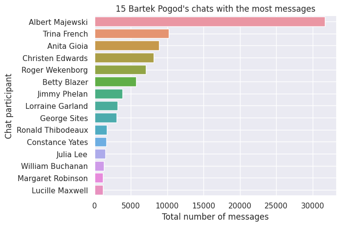
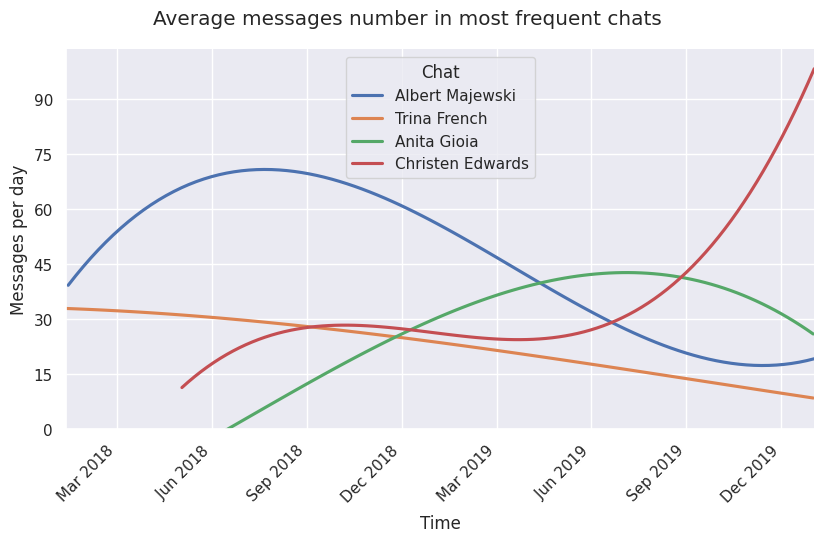
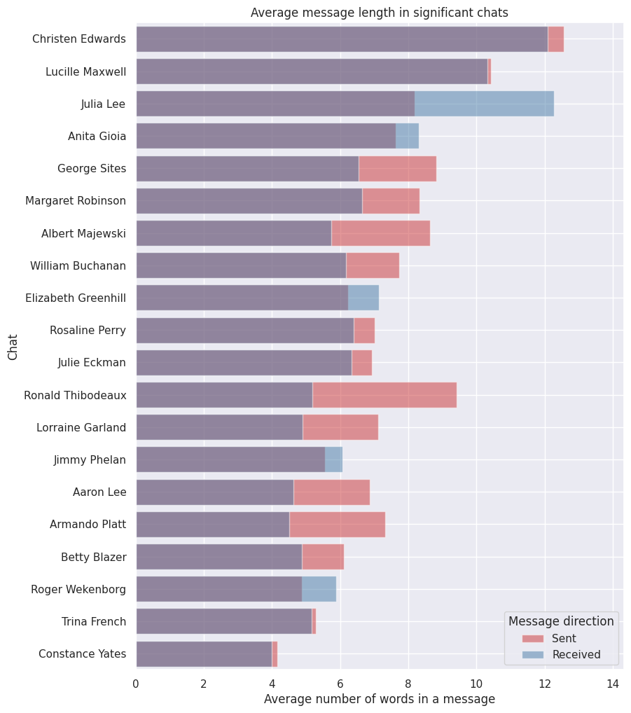
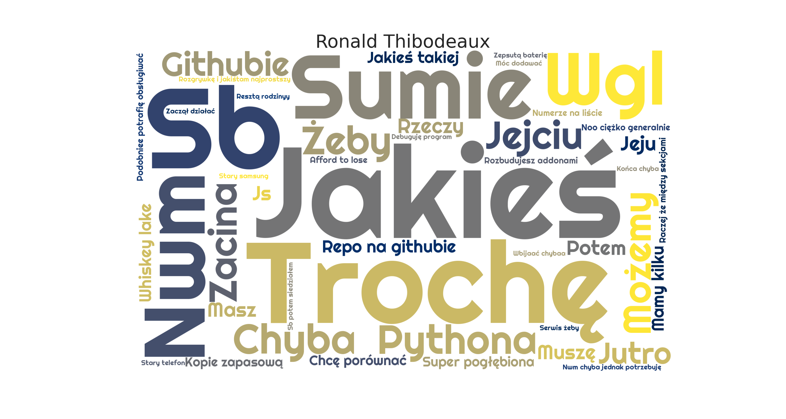
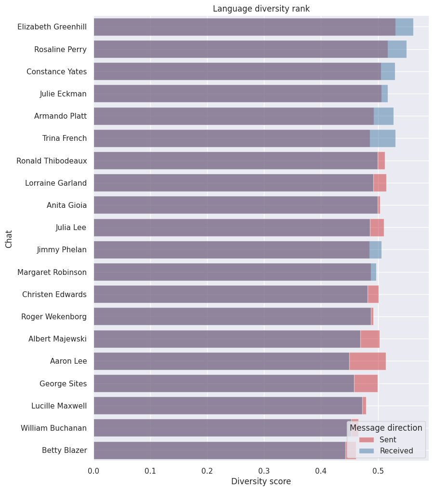

# Messenger Report Generator



For many of us, Messenger is the main communicator. It contains a lot of information about ourselves and our relationships. This repository contains a script that generates a bunch of charts about **your messages history**.

##### Charts generated by the script:

- **messages count** rank
- **overall activity** over time
- average **activity over a day**
- average **activity over a week**
- average **message lengths** in _significant_ chats
- **word clouds** of important phrases in chats
- **activity over time** per chat
- **messages length distributions** in _significant_ chats
- **language diversity** rank _(experimental)_

## Table of contents

1. [Usage](#usage)
   - [Collecting data](#collecting-data)
   - [Setting up the script](#setting-up-the-script)
   - [Running script](#running-script)
1. [Examples](#examples)
   - [Activity in chats plot](#activity-in-chats-plot)
   - [Average messages length in significant chats](#average-messages-length-in-significant-chats)
   - [Chat keyword cloud](#chat-keyword-cloud)
   - [Language diversity rank](#language-diversity-rank)
1. [Contribute](#contribute)

## Usage

#### Collecting data

Facebook enables its users to get their Messenger **messages history**.

Data requesting steps:

1. Go to facebook settings and then proceed to [downloading your data](https://www.facebook.com/dyi/?referrer=yfi_settings).
1. Deselect all data and select only **Messages**
1. Choose data format to **JSON**
1. Choose the multimedia quality to **low** (all the media in chats are downloaded as well but they are omitted by the script)
1. Accept data request

Preparing data file shall not take more than 24h. You will be notified when your file is ready.

#### Setting up the script

After **cloning** this repository place the downloaded zip in `zips` directory and run:

```bash
pip install -r requirements.txt
python -m spacy download pl_core_news_md
python -m spacy download en_core_web_sm
```

In `params.json` you shall set your `"user"`, `"language"` and `"timezone"`.

```JSON
{
  "user": "Bartek Pogod",
  "language": "polish",
  "timezone": "Europe/Warsaw",

  [...]
}
```

#### Running script

If all is set up properly the charts shall be generated after running:

```bash
python messages_analysis.py
```

After a couple of minutes, all the plots shall appear in `figures` folder (or other specified in `params.json`).

## Examples:

#### Activity in chats plot

This plot can show how your relationships changed over time. It can show when your relationships started to form or to collapse. The lines are smoothened to increase visibility.


#### Average messages length in significant chats

This chart can say a lot about the interactions. Usually, longer messages are more formal, possibly more personal. It says _"in significant chats"_, because some chats have too few messages to be considered important.


#### Chat keyword cloud

It is generated using [TextRank algorithm](https://www.aclweb.org/anthology/W04-3252.pdf). Size of the words shall represent the importance of them in a chat. The example chart is in polish, because it is the first language of the author.


#### Language diversity rank

Language diversity score shall represent how diverse is the vocabulary of the speaker in a chat.

To calculate the score the messages sent by a chat participant are prepared - numbers, punctuation and entities are removed. All the words are lemmatized, to get the word base form. Then the messages sent by one person are divided into batches of 2000 words. For every 2000 words, there is calculated the quotient of lemmas number and batch size (2000). The final score is a mean of those quotients.


## Contribute

The possibilities are almost endless. Take a look at the **issues** tab to write your own ideas or see how you can help! Let's make something great :D.
